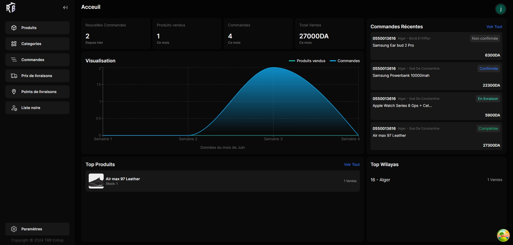
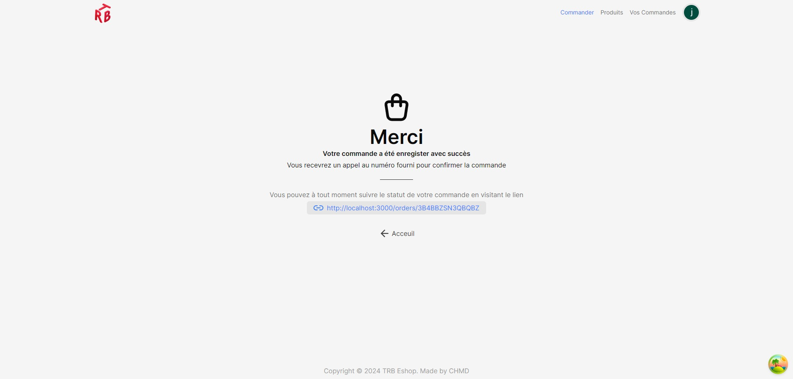

# Orderer

> Note: This app is still a work in progress

Orderer is a simple yet powerful e-store app that will help you manage the essentials of your shop. The design and features were all buit with an emphasis on user experience making it therefore very easy and straightforward to use while keeping a pleasant looking interface.

It is built with [Nextjs 14](https://nextjs.org/) and designed in [Figma](https://www.figma.com/).

The app is aimed to be used by stores within the country of Algeria and comes with a preset of all the wilayas and their relative towns.

## screenshots

  

  

  

## features

- Easy to use product ordering flow.
- Ability for users to track their order.
- Shipping prices and be changed for each wilaya individually.
- Shipping prices can also be set for both home delivery and shipping point delivery.
- Ability to add custom shipping locations with Google maps coordinates and additional cost (if desired).
- Light and Dark themes.
- Ability to blacklist phone numbers.
- Reponsive UI.
- And more...

## License

This project is released under the [GNU GPLv3](https://www.gnu.org/licenses/gpl-3.0.txt).